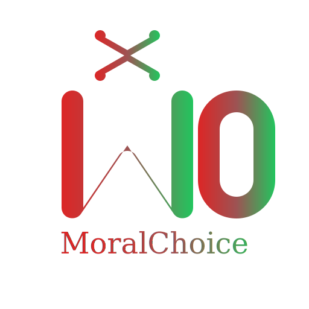

# MoralChoice



## 📖 Description

MoralChoice est une application web interactive qui place l'utilisateur face à des dilemmes moraux inspirés des sept péchés capitaux. À travers une série de scénarios narratifs, l'utilisateur fait des choix qui influencent son score moral, le faisant pencher vers la vertu ou la corruption.

L'application offre une expérience immersive où chaque décision compte et mène à une fin personnalisée reflétant le parcours moral de l'utilisateur.

## ✨ Fonctionnalités

- **Scénarios narratifs** basés sur les sept péchés capitaux
- **Système de choix moraux** avec impact sur le score de l'utilisateur
- **Profil utilisateur** avec statistiques et historique des décisions
- **Visualisation graphique** de la progression morale
- **Fins personnalisées** en fonction du score moral final
- **Installation en tant que PWA** pour une utilisation hors-ligne
- **Interface réactive** adaptée à tous les appareils

## 🛠️ Technologies utilisées

### Frontend
- React
- Vite
- Tailwind CSS
- Framer Motion (animations)
- Zustand (gestion d'état)
- Chart.js (visualisations)
- vite-plugin-pwa (fonctionnalités PWA)

### Backend
- Supabase (base de données et authentification)

## 🚀 Installation

### Prérequis
- Node.js (v14 ou supérieur)
- npm ou yarn

### Étapes d'installation

1. Clonez le dépôt
```bash
git clone https://github.com/taphacoobams/moral_choice.git
cd moral_choice/moral-choice-front
```

2. Installez les dépendances
```bash
npm install
# ou
yarn
```

3. Créez un fichier `.env.local` à la racine du projet avec vos identifiants Supabase
```
VITE_SUPABASE_URL=votre_url_supabase
VITE_SUPABASE_ANON_KEY=votre_clé_anonyme_supabase
```

4. Lancez l'application en mode développement
```bash
npm run dev
# ou
yarn dev
```

5. Accédez à l'application via `http://localhost:5173`

## 📊 Structure de la base de données

L'application utilise les tables Supabase suivantes :
- `sins` : Les sept péchés capitaux avec leurs attributs
- `scenarios` : Les scénarios moraux liés aux péchés
- `scenario_choices` : Les choix possibles pour chaque scénario
- `user_choices` : Les choix effectués par les utilisateurs
- `user_profiles` : Les profils utilisateurs avec leurs scores moraux
- `endings` : Les fins personnalisées basées sur le score moral

## 🧪 Problèmes connus et solutions

- **Duplication des choix dans les scénarios** : Corrigé en implémentant une fonction de dédoublonnage dans le client Supabase
- **Erreur "column ending.moral_range does not exist"** : Nécessite l'ajout de la colonne `moral_range` dans la table `endings` de Supabase

## 🔮 Fonctionnalités futures

- Support multilingue
- Mode multijoueur avec comparaison des choix
- Scénarios personnalisés créés par la communauté
- Système d'achievements
- Partage des résultats sur les réseaux sociaux

## 📝 Licence

Ce projet est sous licence MIT. Voir le fichier LICENSE pour plus de détails.

## 👥 Contributeurs

- [Votre nom](https://github.com/taphacoobams)

---

Développé avec ❤️ et des dilemmes moraux.
